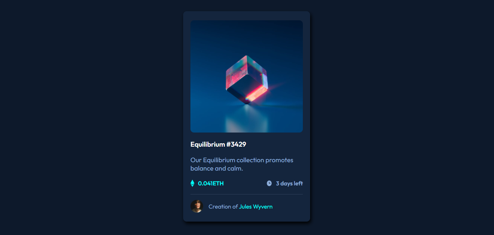

# Frontend Mentor - NFT preview card component solution

### The challenge

Users should be able to:

- View the optimal layout depending on their device's screen size
- See hover states for interactive elements

### Built with

- Semantic HTML5 markup
- CSS custom properties
- CSS Overlay
- Flexbox

### Screenshot

Site Link - https://kajal-06.github.io/NFT-Card/

